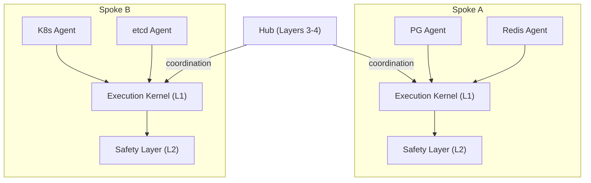

# CrisisMode Architecture

CrisisMode is an AI crisis recovery framework built for the moment when infrastructure is degraded and the cost of wrong actions is highest. This document describes the system architecture, execution model, and extension points.

## Hub-and-Spoke Model

CrisisMode uses a hub-and-spoke deployment topology:

- **Spokes** run close to target systems (same VPC, same cluster, same host). They execute recovery plans and enforce safety constraints. Spokes contain Layers 1 and 2.
- **The Hub** provides coordination, analytics, and enrichment across multiple spokes. It contains Layers 3 and 4.

Spokes operate autonomously when the hub is unreachable. Recovery plans execute locally with full safety validation. When connectivity is restored, spokes sync forensic records and execution state back to the hub.



## Four Layers

### Layer 1: Execution Kernel

The execution kernel runs recovery plans step by step. Two execution engines are available:

- **LegacyExecutionEngine** — Sequential, callback-based. Each step runs in order. Failures halt execution. Suitable for simple recovery flows.
- **RecoveryGraphEngine** — Built on LangGraph. Steps become graph nodes with conditional edges. Supports durable checkpointing (MemorySaver for dev, PostgresSaver for production), interrupt/resume for human-in-the-loop approval, and crash recovery from the last checkpoint.

Both engines share the same `ExecutionBackend` interface for command execution and check evaluation.

### Layer 2: Safety

Every mutating action passes through safety validation before execution:

1. **Blast radius validation** — Verifies the step's declared impact against the agent manifest and context limits.
2. **Preconditions** — Boolean checks that must pass before a command runs. A failed precondition halts the step.
3. **State preservation** — Before/after captures create snapshots for rollback and forensic analysis.
4. **Provider resolution** — Confirms that capability providers exist for every required capability before executing in production mode.
5. **Success criteria** — Boolean checks that run after command execution to verify the action worked.
6. **Approval gates** — `human_approval` steps pause execution until an authorized role approves, rejects, or the timeout escalates.
7. **Forensic recording** — Every step result, state capture, and log entry is written to an immutable `ForensicRecorder` audit trail.

### Layer 3: Coordination (Hub)

The hub provides:

- **Spoke registration** — Spokes register with the hub and report their agent inventories.
- **Cross-spoke correlation** — When a PostgreSQL failure and a Kubernetes pod restart happen simultaneously, the hub correlates these events.
- **Plan orchestration** — Multi-spoke recovery plans that require coordinated action across infrastructure boundaries.

### Layer 4: Enrichment (Hub)

- **AI diagnosis** — Claude-powered analysis of health signals, diagnostic data, and historical patterns. Available for any agent via the universal AI diagnosis module.
- **Historical analysis** — Past incident data improves diagnosis confidence and plan selection.
- **Predictive degradation** — Trend analysis on health signals to detect failures before they become critical.

## Agent Model

Every recovery agent implements the `RecoveryAgent` interface:

```typescript
interface RecoveryAgent {
  manifest: AgentManifest;
  assessHealth(context: AgentContext): Promise<HealthAssessment>;
  diagnose(context: AgentContext): Promise<DiagnosisResult>;
  plan(context: AgentContext, diagnosis: DiagnosisResult): Promise<RecoveryPlan>;
  replan(context: AgentContext, diagnosis: DiagnosisResult, state: ExecutionState): Promise<ReplanResult>;
}
```

The lifecycle flows: **assessHealth** (is something wrong?) -> **diagnose** (what exactly is wrong?) -> **plan** (how do we fix it?) -> **execute** (run the plan) -> **replan** (adapt if conditions change mid-flight).

### Backend Pattern

Each agent defines a system-specific backend interface that extends `ExecutionBackend`:

- **Interface** (`backend.ts`) — Declares system-specific diagnosis methods (e.g., `queryReplicationStatus()` for PostgreSQL).
- **Simulator** (`simulator.ts`) — In-memory implementation with state transitions. Used for demos, tests, and dry-run mode.
- **LiveClient** (`live-client.ts`) — Connects to real infrastructure. Executes actual queries and commands.

### AgentManifest

The manifest declares everything the framework needs to know about an agent:

- **Target systems** — Technology, version constraints, components.
- **Trigger conditions** — Prometheus alerts, health check failures, or manual invocation.
- **Execution contexts** — What privileges and capabilities the agent requires.
- **Risk profile** — Maximum risk level, whether data loss or service disruption is possible.
- **Human interaction** — Whether approval is required, minimum approval role, escalation path.

## Recovery Plan Structure

A `RecoveryPlan` contains metadata, impact assessment, an ordered list of steps, and a rollback strategy. Seven step types are available:

| Step Type | Purpose | Mutating |
|---|---|---|
| `diagnosis_action` | Read-only data gathering | No |
| `human_notification` | Alert stakeholders | No |
| `checkpoint` | Capture state snapshots | No |
| `system_action` | Execute commands with full safety checks | Yes |
| `human_approval` | Gate execution on human decision | No |
| `replanning_checkpoint` | Allow agent to revise remaining plan | No |
| `conditional` | Branch based on system state | Depends |

`system_action` steps carry the most structure: preconditions, state preservation (before/after captures), success criteria, blast radius declarations, rollback directives, and retry policies.

## Playbook System

Playbooks are Markdown files with YAML frontmatter that describe recovery procedures. They compile to the same `RecoveryPlan` structure used by code-based agents.

```
Markdown + YAML frontmatter
        |
        v
  parsePlaybook()     -->  ParsedPlaybook
        |
        v
  playbookToPlan()    -->  RecoveryPlan
        |
        v
  ExecutionEngine     (same safety infrastructure)
```

Playbooks are discovered from three locations:
- `~/.crisismode/playbooks/` (user)
- `./playbooks/` (project)
- `$CRISISMODE_PLAYBOOKS` (environment variable)

See [Playbook Authoring Guide](playbook-authoring.md) for the full format reference.

## Hook System

Hooks allow plugins and playbooks to inject behavior at 9 lifecycle points during plan execution:

| Hook Point | When It Fires |
|---|---|
| `plan:validate` | Before a plan is accepted for execution. Can abort. |
| `plan:validated` | After validation passes. |
| `step:before` | Before each step executes. Can abort. |
| `step:after` | After a step completes successfully. |
| `step:failed` | After a step fails. |
| `precondition:check` | Before preconditions are evaluated. |
| `approval:request` | When a human approval step is reached. |
| `capture:before` | Before state captures execute. |
| `recovery:complete` | After all steps finish. |

Hooks are priority-ordered (lower runs first) and async. Built-in safety hooks occupy priority 0-99. Community and plugin hooks use 100+. Hook handlers receive a `HookContext` with the current plan, step, manifest, and execution state.

## Plugin Ecosystem

CrisisMode supports three plugin types:

### Check Plugins

Health checks, diagnosis scripts, and plan generators distributed as standalone executables or scripts. Discovered from `~/.crisismode/checks/`, `./checks/`, or `$CRISISMODE_CHECKS`. Multiple formats supported: shell scripts, compiled binaries, and Node.js scripts.

### Agent Plugins

Full recovery agents packaged with a `crisismode-agent.json` manifest. Discovered from `~/.crisismode/agents/` or the plugin registry. Agent plugins implement the same `RecoveryAgent` interface as built-in agents.

### Playbooks

Markdown recovery procedures discovered from playbook directories. No compilation step required — the parser and runtime handle conversion to `RecoveryPlan` at load time.

All plugin types follow the same discovery pattern: user directory, project directory, and environment variable override.

## Execution Modes

Two execution modes control whether mutations actually run:

- **`dry-run`** (default) — Reads from real systems, logs what mutations would happen, but does not execute them. All safety checks still run. State transitions are simulated.
- **`execute`** — Runs all operations including system mutations. Requires explicit opt-in via `--execute` flag.

## Key Source Files

| File | Purpose |
|---|---|
| `src/agent/interface.ts` | RecoveryAgent contract |
| `src/framework/engine.ts` | LegacyExecutionEngine |
| `src/framework/graph-engine.ts` | RecoveryGraphEngine (LangGraph) |
| `src/framework/backend.ts` | ExecutionBackend contract |
| `src/framework/hooks/` | Hook system (registry, types, built-in hooks) |
| `src/framework/playbook/` | Playbook parser, runtime, discovery |
| `src/types/step-types.ts` | All 7 recovery step types |
| `src/types/manifest.ts` | AgentManifest type definition |
| `src/types/recovery-plan.ts` | RecoveryPlan structure |
| `specs/foundational/recovery-agent-contract.md` | Authoritative specification |
| `specs/deployment/operations.md` | Hub-and-spoke deployment details |
